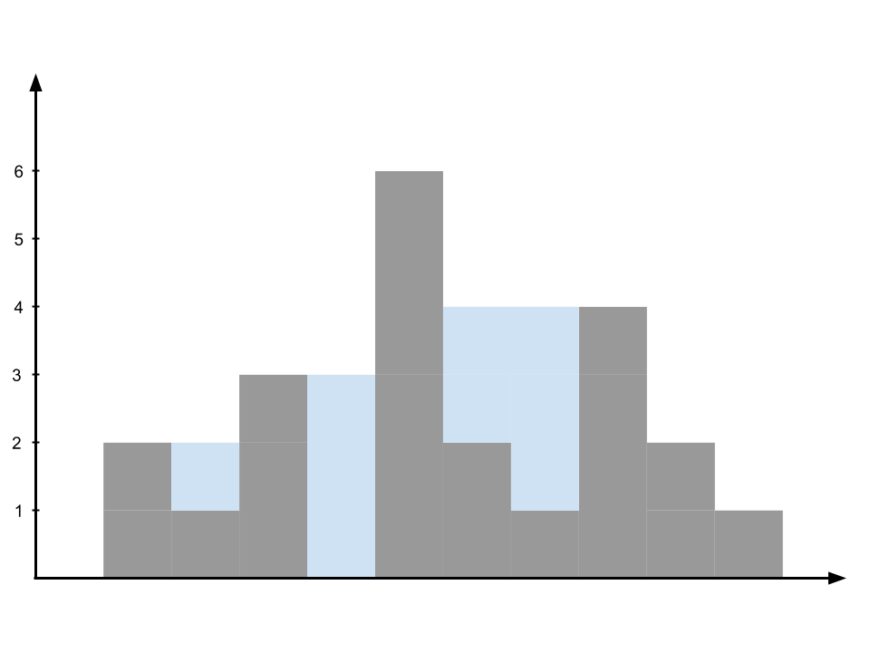

## چاله آب (۱۰۰ امتیاز)

زمینی داریم که در آن تعدادی تپه و چاله وجود دارد. می‌خواهیم ببینیم پس از باران چقدر آب در چاله‌های این زمین ذخیره می‌شود. <br/>
در ورودی n عدد به شما داده می‌شود که هر عدد ارتفاع یک ستون را نشان می‌دهد که طول این ستون یک است و ارتفاع آن برابر عدد وارد شده است.
شما باید مجموع میزان آبی که در این چاله‌ها ذخیره می‌شود را در خروجی نمایش دهید.

<br/>
<br/>

### مثال ها

نمونه اول:

```
Input:
    height = [0,2,1,3,0,6,2,1,4,2,1]

Output: 9
```



نمونه دوم:

```
Input:
    height = [5,2,1,3,1,4]

Output: 9
```

<br/>
<br/>

### محدودیت ها:

<div dir="rtl" >
<li>
همه اعداد آرایه ورودی غیرمنفی هستند.
</li>

<li> 
<span dir="ltr">
n == height.length
</span>
</li>
<li> <span dir="ltr">1 <= n <= 20000 </span></li>
<li> <span dir="ltr">0 <= height[i] <= 100000 </span></li>
</div>
