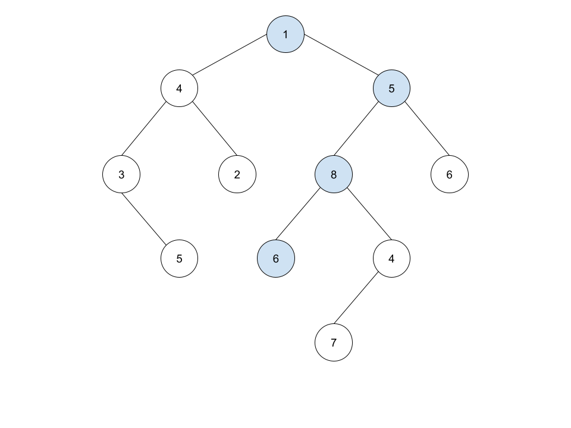
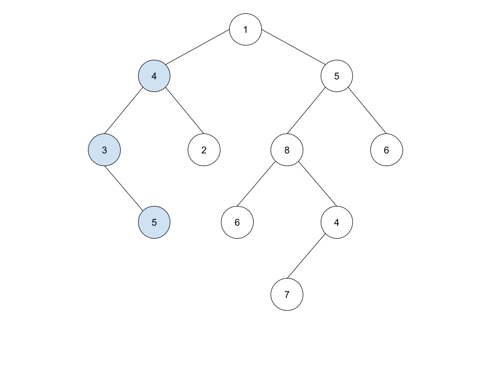

## لیست پیوندی تو درخت (۱۲۰ امتیاز)

به شما ریشه یک درخت دودویی (`root`) و ابتدای یک لیست پیوندی (`head`) داده می‌شود.

در صورت وجود داشتن لیست پیوندی در درخت با همان ترتیب و با حرکت از بالا به پایین، مقدار `true` را برگردانید و در غیر اینصورت ‍‍ مقدار `false` را برگردانید.
منظور از حرکت از بالا به پایین این است که از یک گره شروع کرده و به سمت برگ‌های درخت بروید.

<br/>
<br/>

### مثال ها

نمونه اول:



```
Input:
    head = [1,5,8,6]
    root = [1,4,5,3,2,8,6,null,5,null,null,6,4,null,null,null,null,null,null,7,null,null,null]

Output: true
```

توضیحات : گره‌های رنگ آبی یک زیر درختی از درخت داده شده است.

نمونه دوم:



```
Input:
    head = [4,3,5]
    root = [1,4,5,3,2,8,6,null,5,null,null,6,4,null,null,null,null,null,null,7,null,null,null]

Output: true
```

نمونه سوم:

```
Input:
    head = [5,6,7]
    root = [1,4,5,3,2,8,6,null,5,null,null,6,4,null,null,null,null,null,null,7,null,null,null]

Output: false
```

توضیحات: هیچ مسیری در درخت دودویی وجود ندارد که تمام عناصر لیست پیوندی را شامل شود.

<br/>
<br/>

### محدودیت ها:

<div dir="rtl" >
<li>
میزان گره‌های درخت دودویی بین بازه [1,2500] خواهد بود
</li>
<li>
میزان گره‌های لیست پیوندی بین بازه [1,100] خواهد بود
</li>
<li>
اعداد داخل هر گره لیست پیوندی و درخت دودویی بین [1,100] خواهد بود.
</li>
</div>
