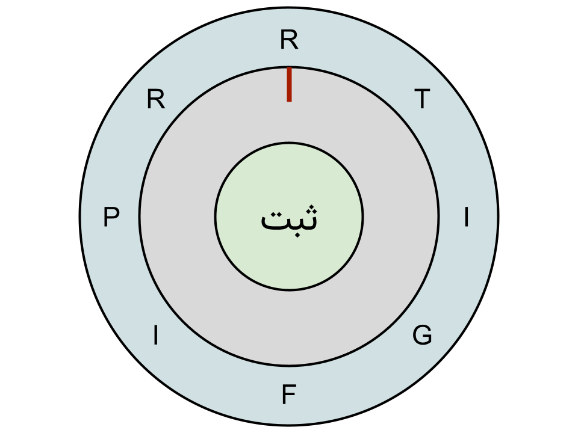

## رمز گاوصندوق (۱۸۰ امتیاز)

در این سوال می‌خواهیم قفل یک گاوصندوق رو به بهینه‌ترین حالت ممکن باز کنیم. برای وارد کردن رمز گاوصندق باید حلقه‌ای رو بچرخونیم که یه سری حروف دورش نوشته شده. چرخاندن این حلقه یک ثانیه طول می‌کشه. زمانی که کاراکتری که می‌خواهیم وارد کنیم در بالاترین نقطه دایره قرار گرفت باید دکمه تایید حرف رو فشار بدیم. فشار دادن این دکمه هم یک ثانیه زمان می‌بره.

دو تا رشته به عنوان ورودی بهتون داده میشه که یکیشون نشان‌دهنده حروف نوشته شده روی گاوصندق و اون یکی رمز گاوصندوقه. هدفمون اینه که کمترین زمانی که طول می کشه تا رمز گاوصندق رو وارد و در گاوصندق رو باز کنیم به دست بیاریم.

در شروع اولین حرف رشته، بالای حلقه قرار داره. شما می‌تونید توی هر مرحله حلقه رو به صورت ساعت‌گرد و یا پادساعت‌گرد بچرخونید.

<br/>
<br/>

### مثال ها

نمونه اول:

```
Input:
    halghe = "RTIGFIPR"
    Ramz = "RI"

Output: 4
```

توضیحات:

از آنجا که حلقه در ابتدا بر رو حرف 'R' قرار دارد، نیاز به چرخاندن حلقه نداریم، دکمه را فشار می‌دهیم و این اتفاق یک ثانیه طول می‌کشد. برای وارد کردن حرف 'I' می‌تونیم حلقه را دو مرحله به صورت پادساعت‌گرد بچرخانیم تا حلقه روی حرف 'I' قرار بگیرد. این عمل به دو ثانیه زمان نیاز دارد. سپس برای ثبت  'I' یک بار دکمه را فشار می‌دهیم که این عمل یک ثانیه زمان میبرد. در نتیجه می‌تونیم در ۴ ثانیه درب گاوصندوق را باز کنیم.

</br>
<div width="100%" style="display:flex; justify-content:center;">

</div>
</br>

نمونه دوم:

```
Input:
    halghe = "RTIGFIPR"
    Ramz = "PIR"

Output: 8
```

توضیحات:

برای وارد کردن حرف P باید حلقه را دو مرحله به صورت ساعتگرد بچرخانیم و سپس دکمه ثبت را فشار دهیم. سپس باید حلقه را یک مرحله دیگر به صورت ساعتگرد بچرخانیم و دکمه را فشار دهیم. در نهایت نیز باید حلقه را دو مرحله به صورت ساعتگرد بچرخانیم و دکمه را فشار دهیم. در نتیجه برای رسیدن به جواب به ۸ ثانیه زمان نیاز داریم.

<br/>
<br/>

### محدودیت‌ها:

<div dir="rtl" >
<li><span dir="ltr"> 1 <= halghe.length, ramz.length <= 100 </span></li>
<li>
حلقه و کلید فقط از حروف کوچک انگلیسی تشکیل شده اند.</li>
<li>
ضمانت می‌شود که رمز عبور با چرخاندن حلقه حتما قابل ساختن باشد. </li>
</div>
